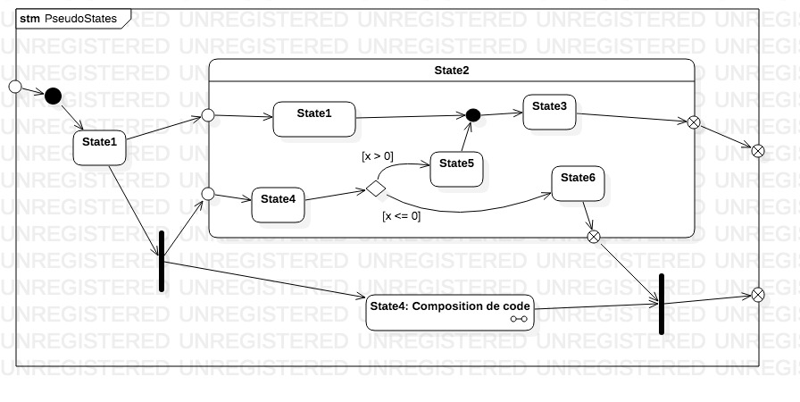

# Diagramme de machine à états finis

| Catégorie | Vue |
|---|---|
| Comportement | Processus |

## Introduction

Les diagrammes de machines à états finis (`STM`) sont des daigrammes comportementaux qui représentent un système sous la forme d'un ensemble d'états reliés entre eux par des trnasitions.
En tant qu'approximation d'une machine de Turing, tout programme peut être vu comme une machine à états finis... même potentiellement très grand.
A chque moment, on peut dire qu'un programme se trouve à chaque instant dans un état donné qui peut être déterminé par l'ensemble de valeurs de ses variables.
Les transistions sont déclenchées par des « événements » et sont le moment où des processus vont être mis en œuvre pour calculer l'état d'arrivée. Ces processus ne sont pas décrits ici. Ils le sont plutot typiquement dans des diagrammes d'activité.

Les `STM` peuvent modéliser des **traits comportementaux** (`behavioral feature`), typiquement des **opérations**. Dans ce cas, les paramètres de la `STM` doivent correspondre à la signature de l'opération (typiquemejt une fonction ou une méthode d'une classe).


## Eléments de base des diagrammes de machines à états finis

### Etats

Un état modélise une situation temporelle pendant laquelle un certain **invariant** est vérifié. Cet invariant est la plupart du temps implicite, du fait du nombre de ses attributs. L'invariant peut être invalidé de diverses manières, comme la survenu d'un événemetn, l'exécution du ligne de programme, etc.

Un état a vocation à être une abstraction qui modélise l'avancement à haut niveau d'un système donné. Cette bastraction ne correspond pas nécessairement à un code précis, mais plutôt à une représentation logique du processus.

Les états sont une sous-classe de ce que UML appelle les « sommets » (`Vertex`)? 

#### Etat simple

Un état simple est représenté simplement bar une boîte arrondie, contenant sa description.


En dehors de sa signification, un état simple peut contenir deux compartiments :
* des activités internes, sui sont étiquetés par trois mots-clefs : Entry - Do - Exit ;
* des transisions internes.

##### Activités internes


Dans l'exemple ci-dessus, l'état est responsable de l'exécution de deux activités lorsque le système “passe” `En attente de validation`.
* A l'entrée une notification doit être envoyée à une personne responsable, via une `Activity`.
* A la sortie, une notification doit être envoyée à la personne qui a fait une demande.

Une activité de type `entry` est exécutée au moment de l'arrivée sur l'état initial, donc avant toute transision ; et inversement pour les activités de type `exit`.
Pour les activités de type `do`, leur statut est un peu particulier puisqu'elles séxécutent **parallèlement** à l'évolution de l'état. Deux cas de figure peuvent alors de produire :
1. L'activité se termine _avant_ que l'état ne change ; dans ce cas, un événement “`completed`” est déclenché ;
1.  l'état change avant que l'activité ne soit terminée, auquel cas cette dernière est interrompue.

#### Composition d'état simples & transistions

Une machine à états finis est un graphe, qui se compose généralement d'un ensemble d'états, reliés entre eux par des **transitions**.
Pour être complète, une machine à états finis aura besoin de spécifier un état initial et un (ou plusieurs) état final. Ces deux états particuliers font partie de ce que UML dénomme des « pseudo-états » (`pseudostate`).

Une machine à états finis simple ressemle à l'exemple suivant :


* Au départ, la machine se trouve dans l'état initial, symbolysé par un rond noir ;
* Chaque état est accompagné de _transistions_ qui conduisent vers d'autres états (la transition `typeChar`) conduit la machine dans un état où un utilisateur a — par exemple — entré un caractère au clavier) ;
* A un moment donné, le processus est considéré comme terminé et l'on aboutit à un état final, symbolisé par un rond noir cerclé ;
* Le processus peut être interrompu ; c'est le cas ici si la personne à fait trop de fautes de frappe ;
* Enfin, la machine complète est encapsulée dans un cadre, dont létiquette contient lemot-clef **`stm`** (pour STate Machine) (le symbole d'interruption est quelqufois porté par le cadre).

##### Transitions

Une transistion entre deux états intervient généralement dans deux cas de figure :

###### L'état source a terminé une certaine tâche
Cela peut se produire dans plusieurs cas, notamment :
* L'état est un état simple et on a spécifié une activité de type `do` ; lorsque cette activité se termine (voire l'ensemble de ces activités) une transition est automatiquement engagée ;
* L'état est un état composite qui est arrivé dans un état final ;
* L'état est un machine implicite dont le processus a été interrompu.

Dans ce type des cas, la transition porte généralement une garde qui énonce une condition sur une valeur de l'état du système.
```
# ([<guard>)?(/<behavior-expression>)?
[result > 0]/filter(result)
``` 

###### Un événement se déclenche, qui force la transition.
Dans ce cas, la transtion doit indiquer le nom de l'événement, ainsi éventuellement qu'une garde :
```
# <trigger>(,<trigger>)*([<guard>)?(/<behavior-expression>)?
keyPressed[keyCode in digitCode]/activateOption(keycode)
``` 

## Diagrammes STM avancés

UML spécifie en réalité trois types d'états :
* les état simples
* les états composites
* les « machines implicites » (`submachine`)

> N.B. Les états implicites ont en fait la même sémantique que les états composites, ais ils sont représentés différemment graphiquement et sont définis dans des diagrammes propres.


#### Etats composites

Un état composite est défini comme contenant une (voire plusieurs) machine(s) à états finis.
Dans sa forme la plus simple, un état composite permet de décrire un état, non pas comme une unité atomique, mais comme une unité capable de transistions internes qui n'ont pas d'impact sur le reste du système.


Dans le diagramme ci-dessus, nous considérons un état composite `Réécriture`, qui se décompose lui-même en plusieurs sous-états caractérisant le processus de correction d'un texte.

Dans ce cas chaque état imbriqué est un _état simple_ et nous avons naturellement besoin de mentionner un état initial et un état final.

Le compartiment interne d'un état composite s'appelle une **région**.
Un état peut tout à fait comporendre plusieurs régions, qui définissent à ce moment-là des alternatives, appelées « états orthogonaux » dans la spécification UML.

Dans le diagramme modifié, nosu représentons deux « versions » possibles (mais mutuellement exclusives) du processus de réécriture du texte.  


##### Transistions internes

Les états composites supportent de transistions internes, c'est-à-dire des transitions pour lesquelles les activités de types `entry`ou `exit` ne sont pas activées.


#### Etat implicites


#### Pseudo-états

Les états et les transitions constituent les éléments fondamentaux des machines à états finis.
En plus des différrntes caégories d'états, UML définit des « pseudo-états » qui ont des rôles spécifiques. Nous avons déjà vu que les états initiaux et finaux font partie de ces peseudo-états.

##### Etat d'inception (`Initial pseudstate`) et état final (`Final pseudostate`)

L'état d'inception (ouinitial) est l'état par défaut dans lequel setrouve le système lorsque la `STM` est activée.
Il ne peut y avoir, au plus, qu'un seul été initial par région d'un machie à état fini. Il arrive que l'état d'inception ne soit pas noté, mais il existe toujours implicietement.
La transition qui part de l'inception peut supporter une opération, mais pas un événement. autrement dit, cette transition est effectuée automatiquement lors de l'activation de la machine à états finis.
 
 A l'opposé, lorsque l'état final est atteint, cela signifie que la machine à états finis a achevé son cycle d'exécution. Un tel état ne peut donc mener nulle part. Une machine à états finis peut se trouver dans différentss états finaux. Dans un jeu comme les échecs, par exemple, il peut exister trois états selon qui a gagné la partie (on peut aussi ajouter un état final qui regroupe les différents cas).
 
 
  
 ##### Terminaison
 
 Une terminaison est un cas particulier d'état final, dans lequel le processus représenté par la machine à étés finis est interromu et son contexte détruit.
 
 
  
 ##### Point d'entrée, point de sortie et référence de connexion (`ConnectionPointReference`)
 
 Les points d'entrée s'utilisent dans les états composites et, surtout, implicites. Ils permettent d'indiquer q'une transition externe a pour cible un état particulier d'une région de l'état cible.
 
En contrepartie des points d'entrée, on peut spécifier des points de sortie, qui ont une sémantique similaire.

Un état ou une machine à étét finis peut posséder un nombre arbitraire de points d'entrée et de points de sortie


  
Dans l'exemple ci-dessus, un diagramme `STM` possède unpoint d'entrée et unpoint de sortie.
Il contient un état composite (`State2`) qui possède lui-même un point d'entrée et un point de sortie.

Les **références de connexion** sont utilisées principalement dans le cas des états implicites.
Elles indiquent dans une machine à états finis qu'une transision a pour cible un certain état par le biais d'un point d'entrée précis.
 
 ##### Choix et jonction
 
 Bien qu'il ne soit absolument pas interdit à un état de posséder un nombre arbitraire de transistions sortantes, il est quelquefois plus simple de représenter des transitions alternatives au moyen du pseudo-état de choix, similaire à ce que l'on trouve dans les diagrammes d'activité.
 Chaque branche sortante du choix doit posséder une **garde** qui permettra d'indiquer sous quelle condition particulière différents états peuvent être atteints.
 
 
 
 Dans l'exsemple ci-dessus, en fonction de la valeur de `x`, la transistion aboutit à l'état `State5` ou à l'état `State6`.
 Deux transisions se rejoignent dans une **jonction** dont la cible et l'état `State3`. Le symbole de jonction pourrait tout à fait ne pas être porté dans le diagramme. 
 
 ##### Fourche et fusion
 
De la même manière, les fourches, que l'on trouve dans d'autres diagrammes de comportements et qui signifie une parallélisation des tâches, permettenent d'indiquer qu'une transition active plusieurs régions d'un état, voire plusieurs états.
 Les segments sortant de la fourche ne peuvent supporter de garde ou d'événement.
 
La fusion est l'exact inverse de la fourche. La transition n'est ralisée que lorsque toutes les transitions entrantes ont elles-mêmes été réalisés

Les segments entrants d'une fusion  ne peuvent supporter de garde ou d'événement.

 
 
Les fourches indiquent que plusieurs branches s'exécutent independamment les unes des autres.
Dans le cas d'unétat composite, cela signifie que la progression dans les différentes régions ne sont pas synchrones. 

##### Histoire

Les histoires, qui peuvent être superficielles ou profondes, sont caractéristiques des états composites ou implicites. 
Elles indiquent qu'un état est persistant dans le temps et que l'état n'a donc pas nécessairement d'état final.
Lorsqu'une transition about à cet état historique, la machine à état fini reprend son processus là où il s'était arrêté.
En programmation, un exemple typique est celui des **générateurs**ou des **coroutines**, qui ne terminent jamais implicitement.

UML admet deux variantes du pseudo-état d'histoire :
* _superficiel_, seul l'état du niveau le plus haut est restauré
* _profond-, les états de tous les états imbriqués (implicites) sont restaurés récursivement.  

 
 
